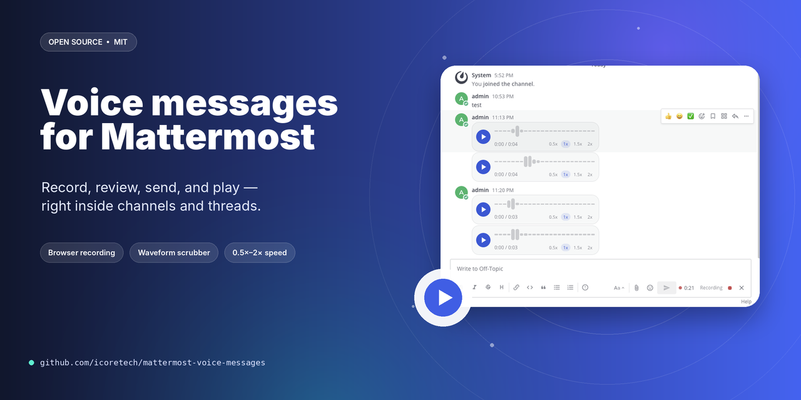

# Mattermost Voice Messages

**WhatsApp-style voice messages for Mattermost channels and threads**

[](https://github.com/icoretech/mattermost-voice-messages/actions/workflows/ci.yml)
[](https://github.com/icoretech/mattermost-voice-messages/actions/workflows/release.yml)
[](https://github.com/icoretech/mattermost-voice-messages/releases/latest)
[](LICENSE)

<p align="center">
  
</p>

The plugin adds a microphone button to Mattermost web and desktop. Users can record a short audio message, listen to it before sending, and post it in a channel or thread.

People reading from Mattermost web, desktop, or a mobile browser get the full voice-message player with waveform and speed controls. People reading from the native Mattermost iOS or Android apps get a regular audio attachment they can play with the mobile app's built-in audio player.

## Features

- Record and send voice messages from Mattermost web and desktop
- Listen before sending
- Send voice messages in channels and threads
- Play messages inline on web, desktop, and mobile browser
- Change playback speed: `0.5x`, `1x`, `1.5x`, and `2x`
- Keep received voice messages playable in the native Mattermost mobile apps
- Show the web player for matching audio files uploaded outside the recorder
- Respect existing Mattermost posting and file-upload permissions
- Optional local browser transcription before sending; no server-side speech-to-text, text-to-speech, or audio processing

## Requirements

- Mattermost Server 8.1+
- File uploads enabled in Mattermost
- Users need permission to post messages and upload files in the target channel
- A modern browser with microphone access for recording
- For client transcription only: a browser compatible with browser-whisper, WebCodecs/WebGPU, or the browser-whisper WASM fallback
- For client transcription only: first-use network access so the browser can download WASM/model weights
- For client transcription only: Mattermost served with `Cross-Origin-Opener-Policy: same-origin` and `Cross-Origin-Embedder-Policy: require-corp` when local transcription is enabled

The record button is available in Mattermost web, desktop, and mobile browser. Native Mattermost iOS and Android users can listen to received voice messages as audio attachments, but they do not get the plugin's record button.

Voice uploads are limited to 25 MiB and 6 hours. Supported formats are WebM, Ogg, MP4/M4A, MP3, and WAV.

## Installation

Download the latest plugin bundle from the [Releases](https://github.com/icoretech/mattermost-voice-messages/releases) page and upload the `.tar.gz` file through **System Console > Plugin Management**.

After uploading, enable **Mattermost Voice Messages** from the plugin list.

### Signature verification

Releases include a detached GPG signature (`.tar.gz.sig`). To verify:

```bash
# Import the public key
curl -sL https://raw.githubusercontent.com/icoretech/mattermost-voice-messages/main/assets/signing-key.asc | gpg --import

# Verify the bundle
gpg --verify ch.icorete.mattermost-voice-messages-*.tar.gz.sig ch.icorete.mattermost-voice-messages-*.tar.gz
```

To add the key to your Mattermost server for automatic plugin signature verification:

```bash
mmctl plugin add key assets/signing-key.asc
```

## Usage

1. Open a channel or thread in Mattermost.
2. Click the microphone button next to the composer.
3. Allow microphone access if the browser asks.
4. Stop recording when finished.
5. Review the clip.
6. If client transcription is enabled, click **Transcribe locally** in the review panel, or wait for transcription to start automatically when the admin has enabled auto-start.
7. Edit or clear the generated transcript. The transcript is sent as the normal Mattermost message text; if cleared, the voice post is sent without message text.
8. Click **Send**, or cancel to discard it.

On web, desktop, and mobile browser, sent voice messages show the custom voice player. On native Mattermost mobile apps, they show as regular audio attachments. If a transcript was sent, it appears as normal post text above the attachment.

## Configuration

Configure the plugin from **System Console > Plugins > Mattermost Voice Messages**.

| Setting | Default | Effect |
| --- | --- | --- |
| `EnableVoiceMessages` | `true` | Shows the microphone recorder and allows voice-message uploads. When disabled, the recorder is hidden and direct upload API calls return `403`. |
| `EnableUploadedAudioPreview` | `true` | Uses the voice-message player for supported audio files uploaded outside the recorder. Existing voice-message posts still render normally. |
| `EnableClientTranscription` | `false` | Allows users to transcribe reviewed voice messages locally in the browser before sending. Requires browser-whisper model downloads on first use and cross-origin isolation headers on the Mattermost site. |
| `ClientTranscriptionAutoStart` | `false` | Starts local transcription automatically after recording stops when client transcription is enabled. When disabled, users click **Transcribe locally** in the review panel. |
| `ClientTranscriptionModel` | `whisper-tiny` | Selects the browser-whisper model to run in the browser. Larger models can require hundreds of MB or GB of local model downloads. |
| `ClientTranscriptionQuantization` | `hybrid` | Selects the model precision passed to browser-whisper. Use `hybrid` unless a browser/device requires a specific mode. |
| `ClientTranscriptionLanguage` | empty | Optional BCP-47 language tag passed to browser-whisper, for example `en` or `it`. Leave empty for auto-detect. Models without language support ignore this value. |

Access is inherited from Mattermost permissions:

- Users must be authenticated.
- Users must be members of the target channel.
- Users must have permission to create posts in the channel.
- Users must have permission to upload files in the channel.

## Development

Install build dependencies:

```bash
cd webapp
npm ci
```

Development builds require Go 1.26+ and Node.js 24+.

Build the plugin bundle:

```bash
make dist
```

The bundle is written to:

```text
dist/ch.icorete.mattermost-voice-messages-<version>.tar.gz
```

### Local Mattermost preview stack

A Docker Compose development stack is included:

```bash
docker compose -f docker-compose.dev.yml up -d
```

By default it serves Mattermost through a local nginx proxy at:

```text
http://localhost:18065
```

The proxy adds the browser isolation headers required by local client transcription:

```text
Cross-Origin-Opener-Policy: same-origin
Cross-Origin-Embedder-Policy: require-corp
```

It also relaxes the local preview Content Security Policy enough for
browser-whisper workers and their WASM backend module loading:

```text
worker-src 'self' blob:
child-src 'self' blob:
script-src 'self' 'wasm-unsafe-eval' blob:
script-src-elem 'self' 'wasm-unsafe-eval' blob:
```

The Mattermost container is only exposed inside the Compose network. Change
the public preview port with `MATTERMOST_DEV_PORT`, and change the Site URL
with `MATTERMOST_DEV_SITE_URL` if you bind the proxy to another hostname.

Deploy to a running local or remote Mattermost server with:

```bash
MM_SERVICESETTINGS_SITEURL=http://localhost:18065 \
MM_ADMIN_USERNAME=admin@example.com \
MM_ADMIN_PASSWORD='password' \
make deploy
```

`make deploy` builds the plugin, uploads the bundle through the Mattermost API,
and enables it.

Personal access token authentication is also supported:

```bash
MM_SERVICESETTINGS_SITEURL=https://mattermost.example.com \
MM_ADMIN_TOKEN='personal-access-token' \
make deploy
```

## Quality gates

Run the same checks used by CI:

```bash
make apply
make manifest-check
go fix -diff ./build/... ./server/...
go vet ./build/... ./server/...
go test -race ./build/... ./server/...
npm --prefix webapp run typecheck
npm --prefix webapp run biome:ci
npm --prefix webapp run react-doctor
npm --prefix webapp run test
npm --prefix webapp run build
make dist
```

`npm --prefix webapp run lint` runs Biome in write mode, TypeScript type
checking, and React Doctor.

## Release

Releases are managed with release-please. The release workflow builds the
Mattermost plugin bundle, signs it with the configured organization GPG secret,
and uploads both the bundle and detached signature to the GitHub release.

## Security

Please report vulnerabilities through GitHub Security Advisories. If advisories
are unavailable, open a minimal issue without sensitive details so maintainers
can arrange a private channel.

Voice audio is uploaded to Mattermost only when the user sends the voice message.
Local transcription runs in the browser before send and does not send audio to
the plugin server for transcription. browser-whisper downloads model assets from
upstream locations on first use.

## License

[MIT](LICENSE) - iCoreTech, Inc.
